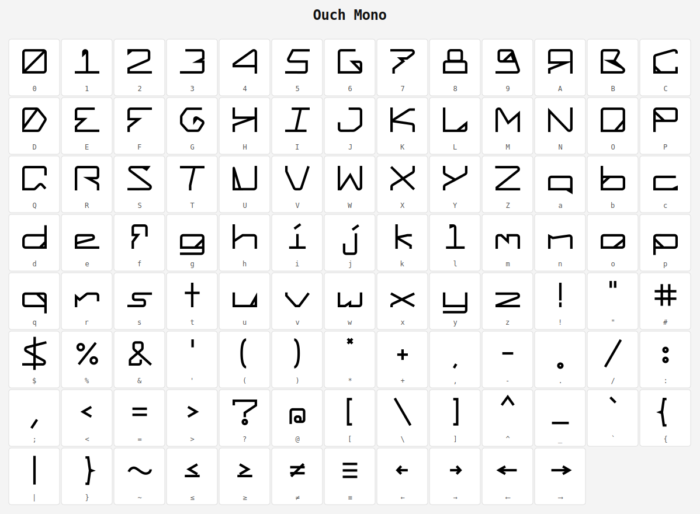

# Ouch Mono

A handcrafted monospace typeface.



## Character coverage

Full printable ASCII (U+0020–U+007E) plus a set of extended math and arrow glyphs:

| Glyph | Unicode | Name |
|-------|---------|------|
| ≤ | U+2264 | Less-than or equal |
| ≥ | U+2265 | Greater-than or equal |
| ≠ | U+2260 | Not equal |
| ≡ | U+2261 | Triple equal |
| ← | U+2190 | Left arrow |
| → | U+2192 | Right arrow |
| ⟵ | U+27F5 | Long left arrow |
| ⟶ | U+27F6 | Long right arrow |

## Installation

**Linux**
```
cp OuchV2.ttf ~/.local/share/fonts/
fc-cache -f ~/.local/share/fonts
```

**macOS**
Double-click `OuchV2.ttf` and click **Install Font**.

**Windows**
Right-click `OuchV2.ttf` and select **Install**.

## Building from source

Requires Python 3 and FontForge:
```
sudo apt install python3-fontforge   # Debian/Ubuntu
```

Then:
```
python3 build_font.py       # builds OuchV2.ttf
python3 build_specimen.py   # builds glyphs.svg
python3 build_readme.py     # builds README.pdf  (requires reportlab)
```

For `build_readme.py`:
```
pip3 install --user reportlab
```

## Source files

Each glyph is a 1000×1000 SVG in the repo root, named by its PostScript glyph name (e.g. `a.svg`, `exclam.svg`, `arrowright.svg`). Edit the SVGs, then re-run `build_font.py` to regenerate the font.
